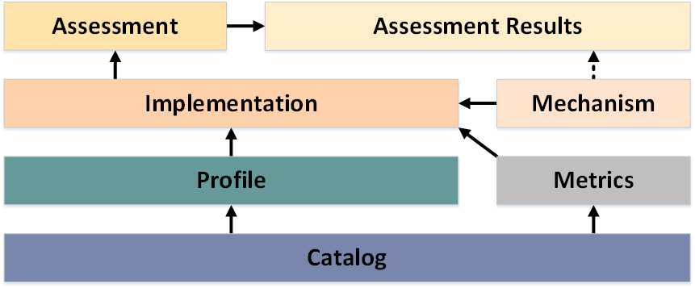

# Open Security Controls Assessment Language (OSCAL) 

NIST is proposing the development of the Open Security Controls Assessment Language, or OSCAL, a hierarchical, formatted, XML-based (and JSON translation) schema that provides a standard for representing different categories of information pertaining to the publication, implementation, and assessment of security controls.

OSCAL aims to:
1. Standardize control, implementation, and assessment information using a open, machine readable formats. 
1. Normalize the semantics of controls, profiles/baselines/overlays across multiple control catalogs (e.g., NIST SP 800.53, ISO/IEC 27001/2, COBIT 5).
1. Provide interoperable formats to ensure that OSCAL information is used by tools in consistent ways.
1. Promote adoption of OSCAL by tool developers by ensuring that OSCAL information is easy to create, use, and customize. 

OSCAL consists of a number of layers:

Starting from the bottom on the left, the OSCAL layers are:
  * __Catalog__: Defines a set of security controls (e.g., NIST SP 800-53 Appendix F); may also define objectives and methods for assessing the controls (e.g., NIST SP 800-53A).
  * __Profile__: Defines a set of security requirements, where meeting each requirement necessitates implementing one or more security controls; also called a _baseline_ or _overlay_.
  * __Implementation__: Defines how each profile item is implemented for a given system component (System Security Plan)
  * __Assessment__: Describes how the system assessment is to be performed
  * __Assessment Results__: Records the findings of the assessment
  
OSCAL will also integrate with: 
  * __Metrics__: Defines metrics and measurements for understanding the effectiveness of the system’s security
  * __Mechanism__: Describes methods used to monitor the system’s current security state (e.g., Security Content Automation Protocol (SCAP))

--------------

## Update August 10th, 2017

As the result of a new OSCAL initiative undertaken starting in mid-May, this repo has been updated. With this effort, we are stressing the agile development of a *minimal* format that is both generic enough to capture the breadth of data in scope (controls specifications), while also capable of ad-hoc tuning and extension to support peculiarities of both (industry or sector) standard and new control types.

In order to enable such a format, we have developed an alternative validation model: the provision for a second "document level" validation layer (by means of declarations also written in OSCAL) means that much of the complexity that OSCAL must support, can be moved away from the base schema. The schema (base tag set) is simpler, while OSCAL can be configured, extended and fitted to new control types and applications, with no schema modification at all. (OSCAL is instead extended using its own declarations.)

The '[working](working)' subdirectory contains the following:

 * '[lib](working/lib)' - schemas along with Schematron, CSS and XSLT
 * '[doc](working/doc)' - documentation including mapping documentation plus supporting code; any tag set docs will also be here
 * '[SP800-53](working/SP800-53)' - OSCAL demo, NIST SP800-53
 * '[ISO27002](working/ISO27002)' - OSCAL demo, ISO 27002
 * '[COBIT5](working/COBIT5)' - OSCAL demo, COBIT 5

## oXygen demo guidelines

Validations and "prettified" (formal) editing are configured for oXygen XML Editor, and sample documents are provided with the necessary glue code. However, software components invoked by these bindings, including XSLTs and CSSs, are standards-based and everything done here with oXygen, could be done on a different platform. Likewise demonstrations we have produced thus far only *scratch the surface* of what is possible with OSCAL.

The new OSCAL offers a new validation model that will provide for easier customization. Instead of requiring schema aggregation or extension, customizing OSCAL is now accomplished by describing an "application usage" of OSCAL elements and class values (much like an HTML/CSS microformat). This set of constraints on controls can be expressed and codified in a set of OSCAL declarations, which can also provide a means of formal (run-time) enforcement. OSCAL declarations give to developers and users the capability to define OSCAL control types, without having to write any schema code.

So defined, application subsets of OSCAL can be put to use in the development of profiles and overlays in the senses described in SP800-53 Rev 4, but also of more free-form and adaptive control models, which perhaps hybridize, combine or synthesize requirements from different control families. As a fairly well-defined XML language, OSCAL *by itself* -- that is, over and above any benefits from having a common format for negotiating among these different information types -- will permit a kind of document transparency and traceability simply impossible in the past, with either published specifications or standards (which were never machine-readable and tractable in these ways) or with the profiles, overlays, derivatives or productions that reference them.

## Controls, not (only) the documents that describe them

OSCAL permits the deployment of an application-specific language for the management of 'controls', defined in a very broad sense.

Inevitably there is a metaphysical grey zone between controls, and the language by which they are defined and described.

OSCAL captures chunks of transcribed natural/literate/technical language, i.e. "prose", but it also permits the rational arrangement of such chunks of language with more tightly controlled values (control properties and parameters). Applied systematically and at scale, such regular and rational arrangements enable higher-order transparencies that can translate into functionalities. In this, OSCAL goes farther than documentary-description XML formats such as JATS, NISO STS, DITA, or other viable alternatives, not in providing a "semantics" for "controls", but in offering a means by which an OSCAL application (or user or developer) may do so.

Accordingly, it is expected that OSCAL would be complementary to any of the formats just mentioned. At the same time, OSCAL is not complete by itself - it requires a 'profile' or 'pattern' among controls in a catalog to be useful, and its best "semantics" are not its own - which is no worse than any standard interchange format.
